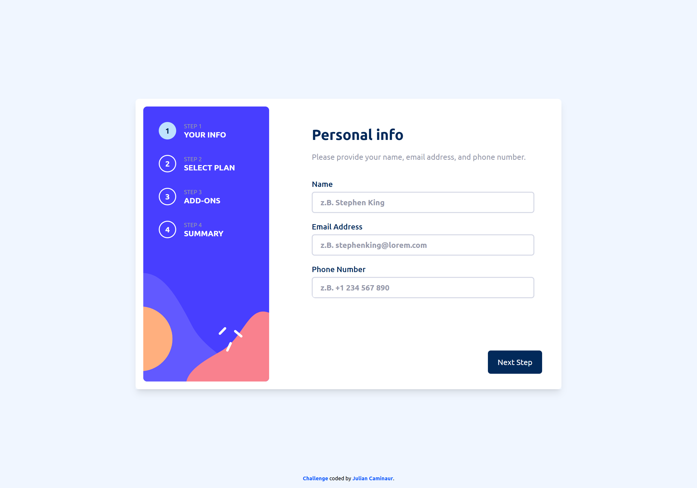
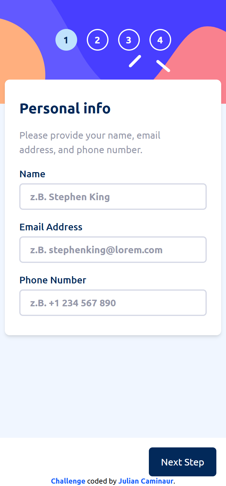

# Frontend Mentor - Multi Step Form Solution

This is a solution to the [Multi Step Form challenge on Frontend Mentor](https://www.frontendmentor.io/challenges/)

## Table of contents

- [Overview](#overview)
  - [The challenge](#the-challenge)
  - [My Solution](#my-solution)
    - [Desktop](#desktop)
    - [Mobile](#mobile)
  - [Links](#links)
- [My process](#my-process)
  - [Built with](#built-with)
  - [Continued development](#continued-development)
  - [Useful resources](#useful-resources)
- [Author](#author)

## Overview

### The challenge

Your users should be able to:

- Complete each step of the sequence
- Go back to a previous step to update their selections
- See a summary of their selections on the final step and confirm their order
- View the optimal layout for the interface depending on their device's screen size
- See hover and focus states for all interactive elements on the page
- Receive form validation messages if:
  - A field has been missed
  - The email address is not formatted correctly
  - A step is submitted, but no selection has been made

### My Solution

#### Desktop

#### Mobile

### Links

- Live Site URL: [Live site](https://caminaur-multi-step-form.netlify.app/)
- Solution URL: [Github](https://github.com/Caminaur/Multi-step-form)

### Built with

- Semantic HTML5 markup
- CSS custom properties
- Mobile-first workflow
- [React](https://reactjs.org/)
- [Tailwind](https://tailwindcss.com/)

### Continued development

I aim to improve my design planning process to make it more efficient and structured, allowing me to create better layouts faster. I also want to keep getting better at Tailwind CSS to write cleaner and more reusable styles. Improving these skills will help me build better projects more quickly.

## Author

- [Website](https://julian-caminaur.tech/)
- [Frontend Mentor](https://www.frontendmentor.io/profile/Caminaur)
- [CSS Battle](https://cssbattle.dev/player/caminaur)
- [Exercism](https://exercism.org/profiles/Caminaur)
